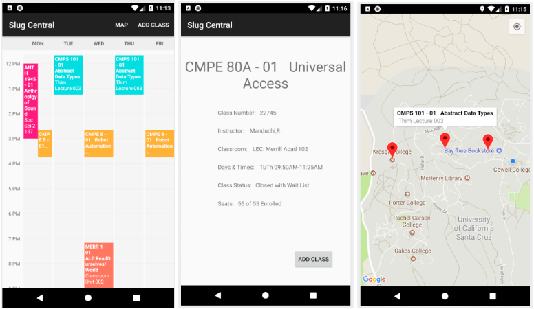

# Slug Central
**Slug Central** is a mobile app for UCSC students to search up classes to get course information as well as plan schedules for upcoming academic terms.

## Inspiration
The purpose of this application is to provide a convenient way for students to look up course information and plan their class schedule for each academic quarter. The current academic information systems portal MyUCSC is extremely slow, making it a hassle for students to use to look up course information or plan class schedules for upcoming quarters. As a result, many students utilize taking notes, opening multiple web browsers, or external applications to get course information. We wanted to alleviate this struggle UCSC students have with getting course information.

## Summary
Slug Central provides an easy way to search up classes and access course data such as the professor, location, seats open, etc. and add them to a weekly planner view. Users can also view the location of the courses they added to their planner along with their current location. Users can also check off which GE requirements they have completed and all the user data is saved on their phone.

## Made with
Java

## Challenges faced:
Making a database to store all the course data.

## Future Plans
* Allow users to sign in to with google and export their weekly schedule to Google Calendar. 
* Include ability to change term and continuously update database of course data to provide real-time information.
* Refine search bar
* Display requirements for each major

## Created By
[Kevin Lim](https://github.com/klimbin), [Robert Loquinario](https://github.com/lokinario), [Thomas Wong](https://github.com/twong40), [Filip Haltmayer](https://github.com/fhaltmayer)
